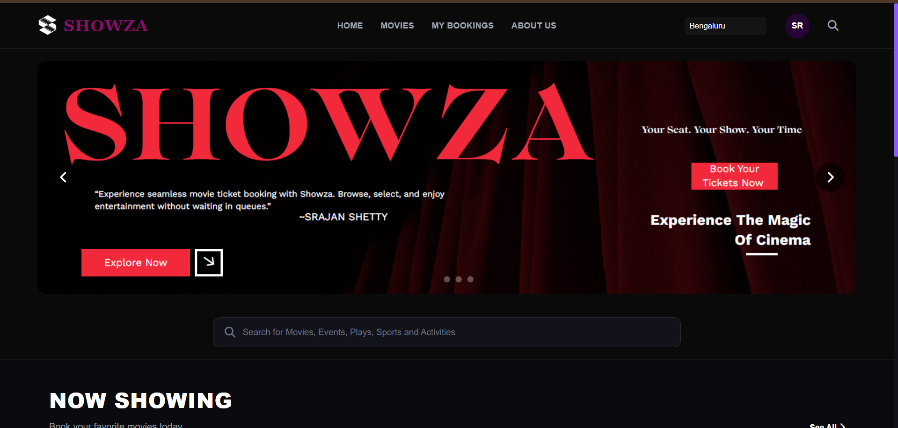
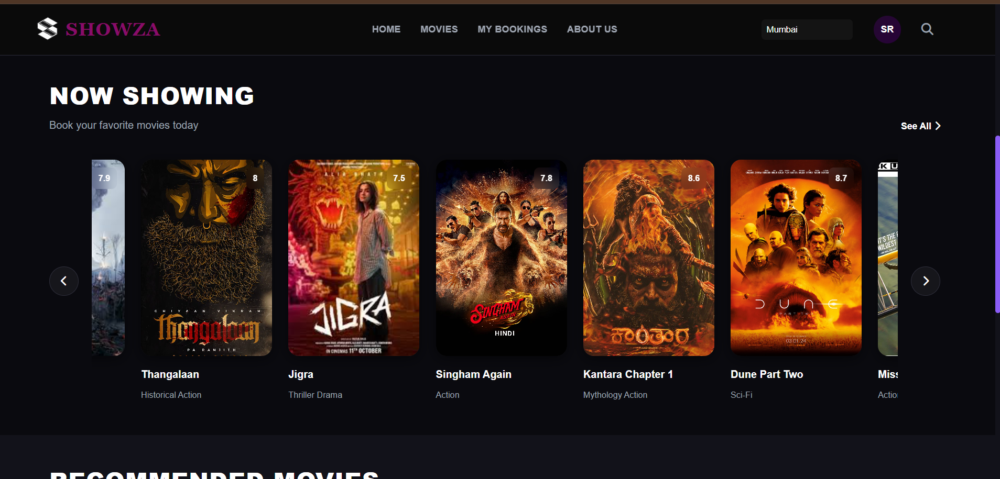
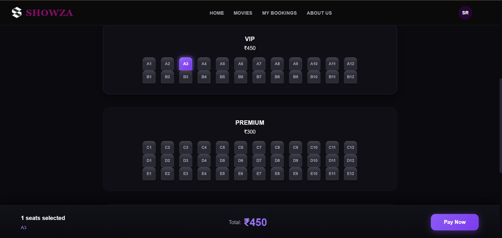
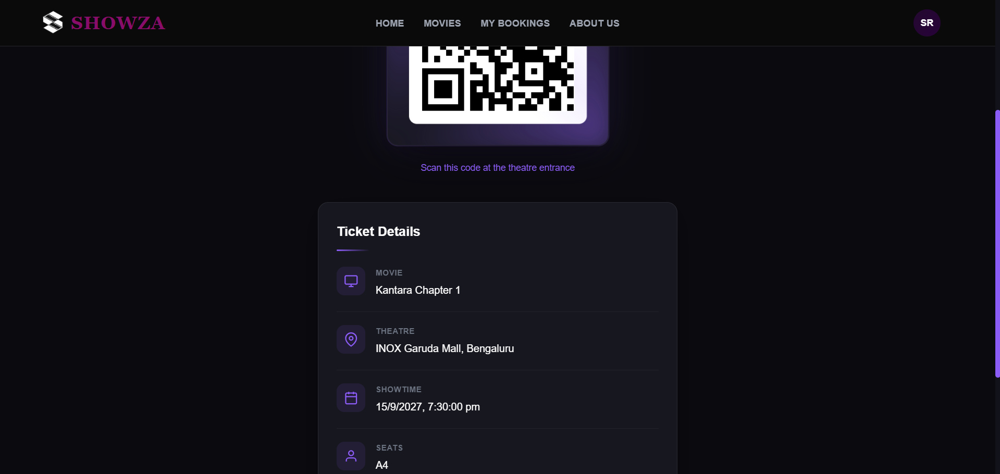
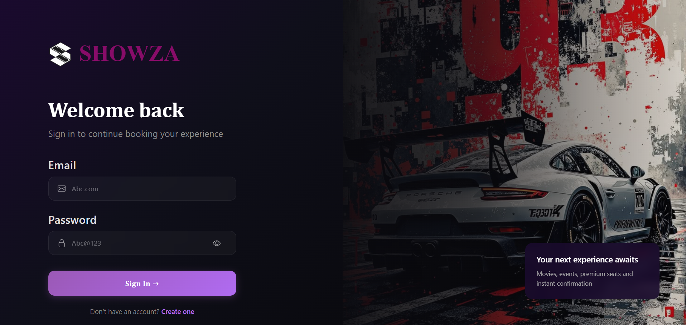
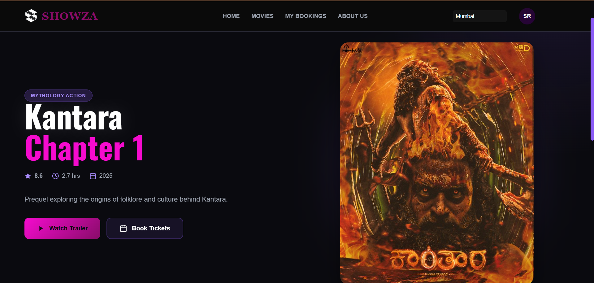
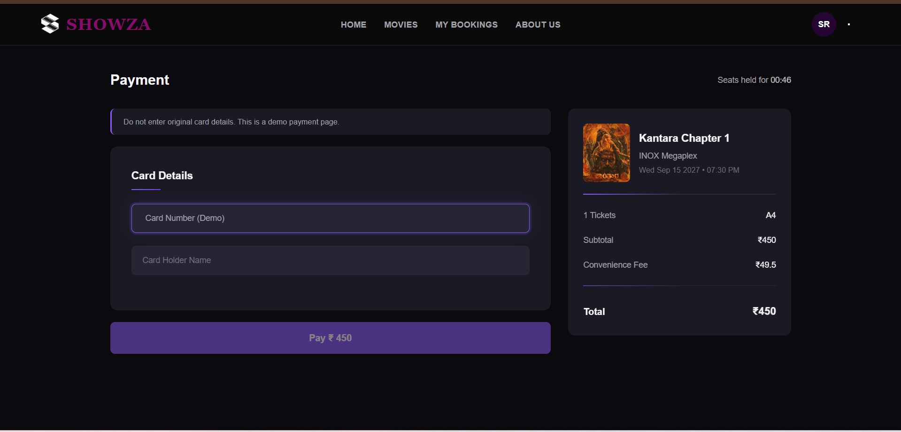
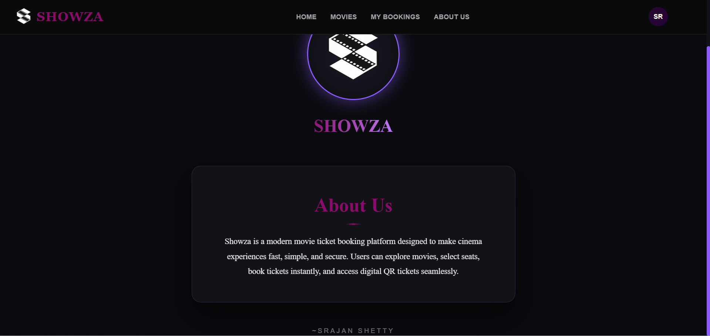

# Showza Movie Booking Platform

Showza is a full-stack movie ticket booking web application that allows users to browse movies, reserve seats, complete bookings, and generate QR-based digital tickets.

---

## Live Application

Frontend:https://showza-omega.vercel.app/

Backend services are deployed using Render and securely integrated with the frontend through authenticated REST APIs.

---

## Application Screenshots

### Home Page

### Movie Listing

### Seat Booking Interface

### Generated Ticket with QR Code

### Login Page

### Movieinfo Page

### Payment Page

### About Me

---

## Tech Stack

### Frontend
- HTML
- CSS
- JavaScript
- Bootstrap

### Backend
- FastAPI
- SQLAlchemy ORM
- JWT Authentication (OAuth2)
- Python
- PostgreSQL
- Docker

### Deployment
- Frontend hosted on Netlify
- Backend hosted on Render

---

## Features

- User Registration and Authentication using JWT
- Public movie browsing without authentication
- Secure seat booking system
- Seat locking mechanism with automatic timeout release
- Concurrency handling to prevent double booking
- Payment simulation with booking confirmation
- QR code generation for booked tickets
- Ticket download functionality
- Ticket cancellation system
- Protection against fake login attempts
- Clean and responsive professional UI

---

## Backend Engineering Highlights

- Designed complete relational database schema
- Implemented seat locking using timestamp-based auto release logic
- Prevented race conditions and double payment scenarios
- Built RESTful APIs using FastAPI
- Implemented secure route protection using JWT token validation
- Generated QR codes dynamically using booking data

---

## Frontend Engineering Highlights

- Fully responsive user interface
- Dynamic ticket rendering using backend APIs
- Secure token handling using local storage
- Interactive booking and cancellation workflow

---

## System Architecture

Frontend (Netlify) communicates with Backend (Render) through REST APIs.  
Backend manages authentication, database operations, seat concurrency handling, and ticket generation.

---

## Authentication Flow

- Users authenticate using JWT-based login
- Public routes available for browsing movies
- Protected routes enforced for seat booking, ticket generation, and cancellation

---

## Concurrency and Data Integrity

- Seat locking prevents multiple users from reserving the same seat simultaneously
- Automatic seat release if payment is not completed within timeout period
- Transaction validation prevents duplicate bookings and payments

---

## Future Improvements

- Integration with real payment gateway
- Email ticket delivery system
- Admin dashboard for movie and showtime management
- Real-time seat availability updates

---

## Author

Developed by Srajan Shetty
